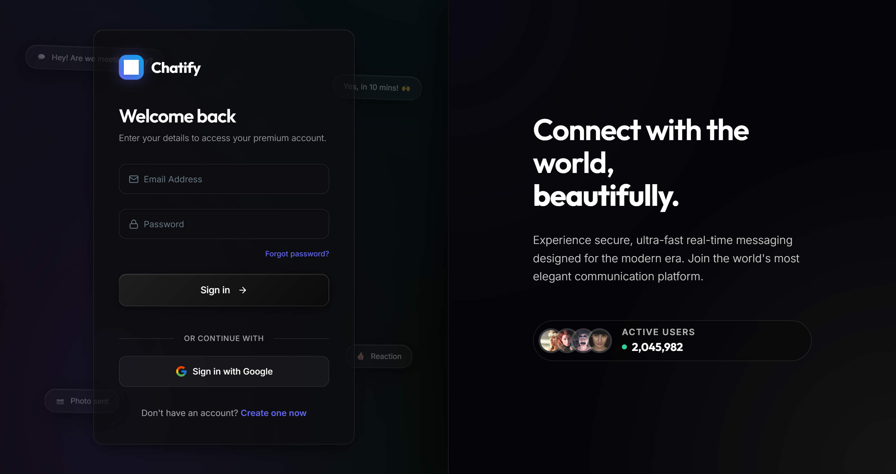
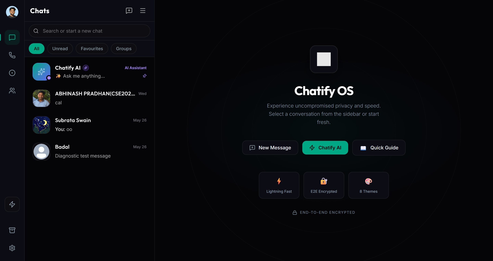

<div align="center">

# 💬 TalkSphere

### Modern Full-Stack Real-Time Messaging Platform

A modern full-stack real-time messaging platform built with the **MERN Stack**, **Socket.IO**, **Firebase Authentication**, and **Google OAuth**. TalkSphere enables secure one-to-one messaging, group conversations, media sharing, voice and video calling, and real-time user presence through a fast, responsive, and intuitive interface.

<p align="center">
  <a href="https://real-time-chat-app-t40f.onrender.com">
    
  </a>
</p>

<p align="center">
  <a href="https://github.com/abhinashp25/Real-time-Chat-App">
    
  </a>
  <a href="https://github.com/abhinashp25/Real-time-Chat-App/network/members">
    
  </a>
  <a href="https://github.com/abhinashp25/Real-time-Chat-App/blob/main/LICENSE">
    
  </a>
</p>


</div>

---

# 📖 Overview

**TalkHub** is a modern full-stack real-time messaging platform designed to provide a fast, secure, and seamless communication experience.

Built with the **MERN Stack**, **Socket.IO**, **Firebase Authentication**, and **Google OAuth**, the application supports instant messaging, media sharing, voice and video calls, group conversations, online presence tracking, and a responsive user interface inspired by modern messaging applications.

---

# ✨ Core Features

## 💬 Messaging

- ⚡ Real-Time One-to-One Messaging
- 👥 Group Chats
- 📨 Instant Message Delivery
- ❤️ Message Reactions
- 😀 Emoji Support
- 🕒 Persistent Chat History
- 🔍 Search Conversations

---

## 📞 Communication

- 📷 Image Sharing
- 📁 File Sharing
- 🎤 Voice Messages
- 📞 Audio Calling
- 🎥 Video Calling

---

## 👤 Authentication & Security

- 🔐 Firebase Authentication
- 🔑 Google OAuth Login
- 👤 Secure User Registration & Login
- 🛡️ Protected Routes
- 🔒 Secure User Sessions

---

## 🟢 Real-Time Presence

- 🟢 Online / Offline Status
- ⌨️ Typing Indicators
- 🔔 Instant Notifications
- 📩 Unread Message Indicators

---

## 🎨 User Experience

- 🌙 Dark Mode
- ☀️ Light Mode
- 📱 Fully Responsive Design
- 🎨 Clean WhatsApp-Inspired Interface
- ⚡ Fast Navigation

---

# 📸 Application Preview

> Add screenshots inside an **images** folder.

```
images/
│── login.png
│── signup.png
│── home.png
│── chat.png
│── group-chat.png
│── video-call.png
```

Example:

```markdown
## Login



## Chat Window




```

---

# 🛠️ Tech Stack

### Frontend

- React.js
- Tailwind CSS
- React Router DOM
- Axios

### Backend

- Node.js
- Express.js
- Socket.IO

### Database

- MongoDB
- Mongoose

### Authentication

- Firebase Authentication
- Google OAuth

### Deployment

- Render

---

# 📂 Project Structure

```
Real-time-Chat-App/
│
├── frontend/
│   ├── public/
│   ├── src/
│   └── package.json
│
├── backend/
│   ├── controllers/
│   ├── middleware/
│   ├── models/
│   ├── routes/
│   ├── socket/
│   ├── utils/
│   ├── server.js
│   └── package.json
│
├── README.md
└── .gitignore
```

---

# 🚀 Getting Started

## Clone Repository

```bash
git clone https://github.com/abhinashp25/Real-time-Chat-App.git
```

Navigate to the project:

```bash
cd Real-time-Chat-App
```

Install backend dependencies:

```bash
cd backend
npm install
```

Install frontend dependencies:

```bash
cd frontend
npm install
```

---

# ⚙️ Environment Variables

Create a `.env` file inside the backend folder.

```env
PORT=5000

MONGO_URI=YOUR_MONGODB_CONNECTION_STRING

FIREBASE_API_KEY=YOUR_FIREBASE_API_KEY

FIREBASE_AUTH_DOMAIN=YOUR_FIREBASE_AUTH_DOMAIN

FIREBASE_PROJECT_ID=YOUR_FIREBASE_PROJECT_ID

FIREBASE_STORAGE_BUCKET=YOUR_FIREBASE_STORAGE_BUCKET

FIREBASE_MESSAGING_SENDER_ID=YOUR_FIREBASE_MESSAGING_SENDER_ID

FIREBASE_APP_ID=YOUR_FIREBASE_APP_ID
```

---

# ▶️ Run the Project

Backend

```bash
npm run server
```

Frontend

```bash
npm run dev
```

---

# 🌐 Live Demo

### 🚀 https://real-time-chat-app-t40f.onrender.com

---

# ⭐ Highlights

- 💬 WhatsApp-inspired messaging experience
- ⚡ Real-Time Communication with Socket.IO
- 🔐 Secure Firebase Authentication
- 🔑 Google OAuth Integration
- 📞 Audio & Video Calling
- 📁 File & Image Sharing
- 👥 Group Chat Support
- 🟢 Live Online Presence
- ❤️ Message Reactions
- 😀 Emoji Support
- 🌙 Dark & Light Theme
- 📱 Responsive on Desktop, Tablet & Mobile
- 🚀 MERN Stack Architecture

---

# 🎯 Learning Outcomes

This project strengthened my practical knowledge of:

- Full Stack Web Development
- React.js
- Node.js
- Express.js
- MongoDB
- Socket.IO
- Firebase Authentication
- Google OAuth
- REST API Development
- Real-Time Communication
- Responsive UI Design

---

# 👨‍💻 Author

## Abhinash Pradhan

Computer Science Engineering Student

🌐 Portfolio  
https://my-portfolio-ten-iota-hup9a33ntx.vercel.app/

💼 LinkedIn  
https://www.linkedin.com/in/abhinash-pradhan/

🐙 GitHub  
https://github.com/abhinashp25

---

<div align="center">

### ⭐ If you like this project, consider giving it a Star.

**Built with ❤️ using React.js, Node.js, Express.js, MongoDB, Socket.IO & Firebase**

</div>
